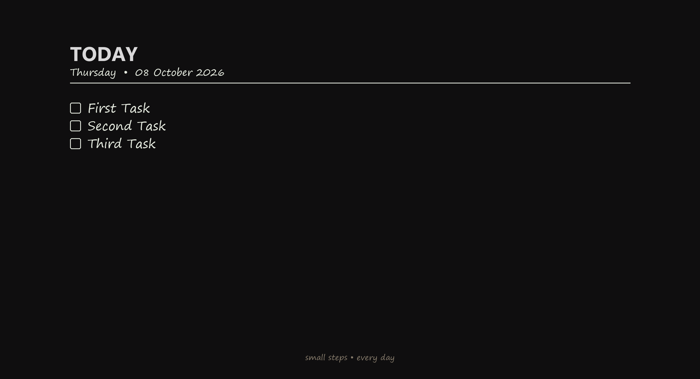
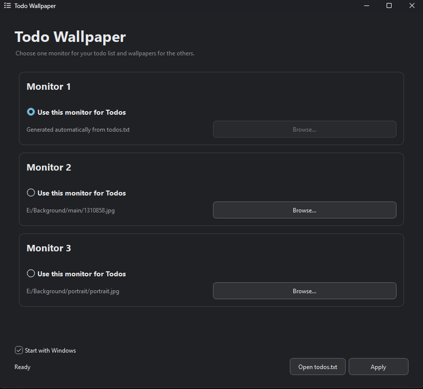

# Todo Wallpaper

A lightweight Windows desktop app that turns a simple `todos.txt` file into a Todo wallpaper and lets you configure wallpapers across multiple monitors.




## Features

* 🖥️ **Multi-monitor support**
* 📝 Uses a simple `todos.txt` file as the Todo list
* 🔄 Automatically updates the Todo wallpaper when `todos.txt` changes
* 🎨 Automatically follows the Windows light/dark theme
* 🖼️ Choose a custom wallpaper for each non-Todo monitor
* 📐 Generates the Todo wallpaper using the actual monitor resolution
* ⚙️ Saves monitor and wallpaper configuration
* 🪟 Uses the native Windows Desktop Wallpaper API for reliable monitor targeting
* 🧩 Modular Python/PySide6 architecture

## How it works

The application lets you choose one monitor for your Todo list.

That monitor receives a generated wallpaper based on the contents of:

```text
todos.txt
```

Every non-empty line is treated as a Todo.

For example:

```text
First task
Second task
Third task
```

The remaining monitors can use any image you select through the application.

When `todos.txt` changes, the Todo wallpaper is automatically regenerated.

## Installation

### Requirements

* Windows 10/11
* Python 3.10+
* PySide6
* Pillow
* comtypes

Install the dependencies:

```bash
pip install -r requirements.txt
```

Or:

```bash
pip install PySide6 Pillow comtypes
```

## Running

Clone the repository:

```bash
git clone https://github.com/AlirezaDa-jc/todo-wallpaper
cd todo-wallpaper
```

Run:

```bash
python main.py
```

On the first run, the application creates a default `todos.txt` if one does not already exist.

## Usage

### 1. Choose the Todo monitor

Select:

> **Use this monitor for Todos**

for the monitor where you want your Todo list displayed.

### 2. Select wallpapers

For the other monitors, click:

> **Browse...**

and select the wallpaper you want to use.

### 3. Apply

Click:

> **Apply**

The application will generate the Todo wallpaper and apply all selected wallpapers.

### 4. Edit your Todos

Open `todos.txt` and add, remove, or edit tasks.

The Todo wallpaper will automatically update when the file changes.

## Project structure

```text
todo-wallpaper/
│
├── main.py
├── config.py
├── requirements.txt
├── todos.example.txt
├── README.md
│
├── core/
│   ├── __init__.py
│   ├── wallpaper.py
│   ├── todo_manager.py
│   └── todo_renderer.py
│
└── ui/
    ├── __init__.py
    ├── main_window.py
    ├── monitor_card.py
    └── theme.py
```

### `core/`

Contains the application logic:

* `wallpaper.py` — Windows monitor detection and wallpaper management
* `todo_manager.py` — reading and monitoring `todos.txt`
* `todo_renderer.py` — generating the Todo wallpaper

### `ui/`

Contains the graphical interface:

* `main_window.py` — main application window
* `monitor_card.py` — individual monitor configuration cards
* `theme.py` — Windows light/dark theme styling

## Monitor handling

The application does not assume that the order of monitors returned by different Windows APIs is identical.

Instead, it matches the physical monitor geometry reported by Windows with the monitor identifiers used by the Windows Desktop Wallpaper API.

This allows wallpapers to be assigned to the intended physical displays without relying on hardcoded monitor-number mappings.

## Configuration

The application creates a local `config.json` containing the selected Todo monitor and wallpaper paths.

This file is intentionally not tracked by Git because the paths are specific to each user's computer.

Generated wallpaper images are stored in:

```text
generated/
```

These files are also ignored by Git.

## Todo format

Each non-empty line in `todos.txt` represents one Todo:

```text
First task
Second task
Third task
```

No special syntax is required.

## Technologies

* **Python**
* **PySide6 / Qt**
* **Pillow**
* **Windows Desktop Wallpaper API**
* **COM / `comtypes`**

## License

This project is licensed under the MIT License. See [LICENSE](LICENSE) for details.
